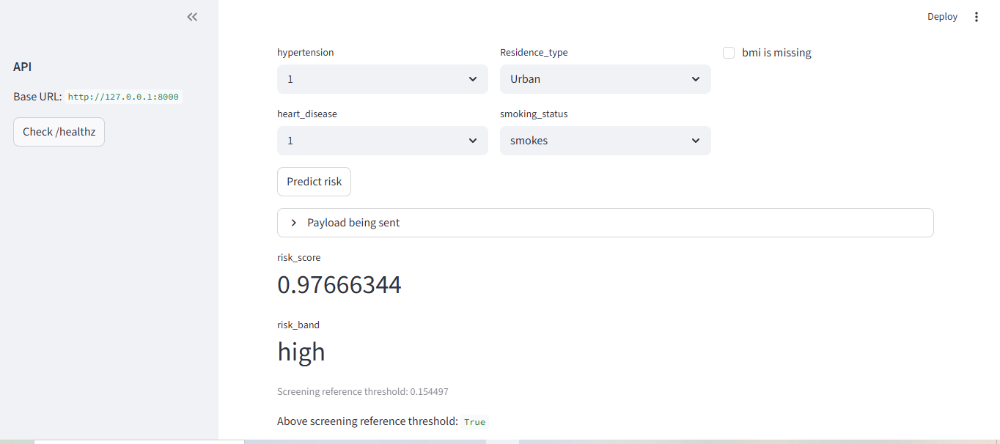
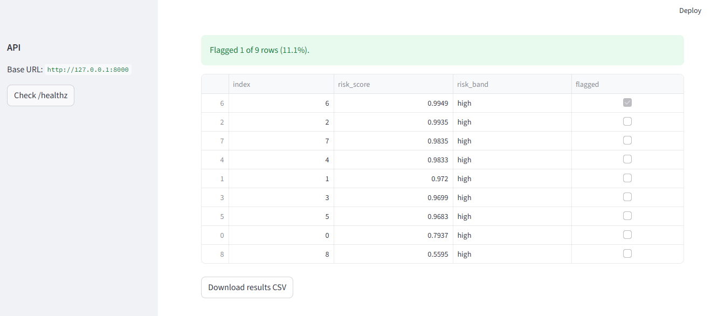

# Stroke AI — capacity-based screening demo (FastAPI + Streamlit + LightGBM)

A spec-driven portfolio project that produces **stroke risk scores** from structured patient features and supports a **capacity-constrained screening workflow** (flag the top *K%* highest-risk records).

## Demo screenshots

### Single prediction


### Batch screening (top-K)


### API docs


## Disclaimer (Important)
This project is **not a medical device** and **not** intended for real clinical diagnosis or treatment decisions.  
Outputs are for **demo / educational purposes only**.

---

## What this app does

### 1) `/predict` (single record)
Returns:
- `risk_score` (0–1)
- `risk_band` (low/medium/high)

It **does not** return a diagnosis label.

### 2) `/screen` (batch)
Implements a capacity-based decision policy:
- flags **exactly the top K fraction** of records by predicted risk (default `top_k = 0.10`)
- tie-breaking is deterministic (stable)

This is often more realistic than choosing a fixed probability threshold when you only have resources to review a limited number of cases.

---

## Results (current baseline)
Trained with LightGBM + train-only RandomOverSampler, evaluated with **top_k = 0.10** exact-rank screening policy:

- ROC-AUC: **0.797**
- PR-AUC: **0.200**
- At top 10% flagged:
  - Precision: **0.208**
  - Recall: **0.421**
  - F1: **0.278**

> Interpretation: when reviewing the top 10% highest-risk records, about **1 in 5** flagged records are true positives in this dataset, and the system catches about **42%** of true stroke cases.

---

## Quickstart (No Docker)

### 1) Dataset
Place your dataset CSV here (not committed):
- `data/raw/stroke.csv`

### 2) Create env + install
```bash
python -m venv .venv
# Windows:
.venv\Scripts\activate
# macOS/Linux:
# source .venv/bin/activate

pip install -U pip
pip install -e ".[dev]"
```

### 3) Train (creates `artifacts/`)
```bash
python -m stroke_ai.models.train
```

### 4) Run API
```bash
uvicorn apps.api.main:app --reload --host 0.0.0.0 --port 8000
```

API docs:
- http://localhost:8000/docs
Policy:
- http://localhost:8000/policy

### 5) Run Streamlit UI (new terminal)
```bash
set API_BASE_URL=http://localhost:8000
streamlit run apps/ui/streamlit_app.py
```

UI:
- http://localhost:8501

---

## Docker (optional)
A `docker-compose.yml` is included. I recommend using Docker Desktop + Linux engine (WSL2) on Windows.

Note: I could not test Docker on my current machine (Docker Desktop installation not available), so please use the non-Docker quickstart above if you run into environment issues.

---

## Repo structure
- `docs/` — PRD, data contract, API spec, model spec, test plan
- `src/` — training + evaluation code
- `apps/api` — FastAPI inference service
- `apps/ui` — Streamlit UI
- `artifacts/` — model + metrics + policy (gitignored by default)

---

## Responsible use notes
- This is a **screening demo**, not a diagnostic system.
- Model behavior depends heavily on the dataset distribution and feature availability.
- The “flagged” output is only defined for batch screening using the top-K policy.
- Monitor: flag rate, score distribution, and data drift if used beyond a demo.

---

## License
Add a license (MIT recommended for portfolio projects).